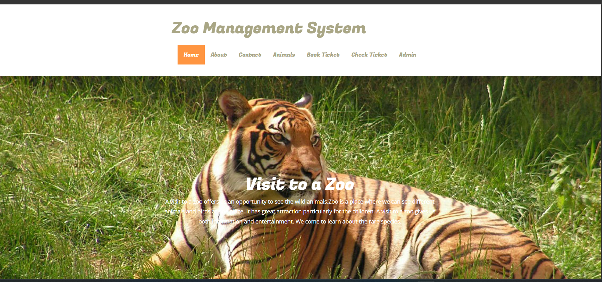
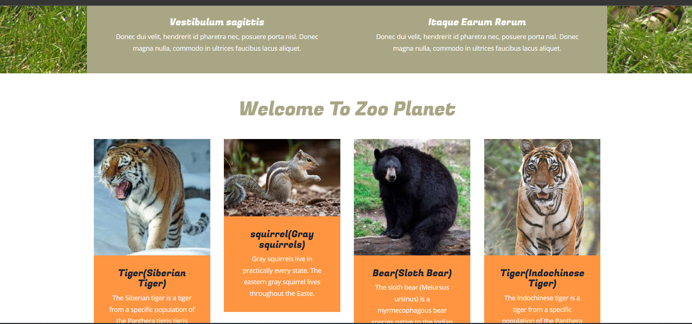
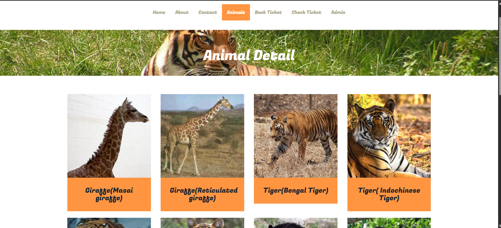
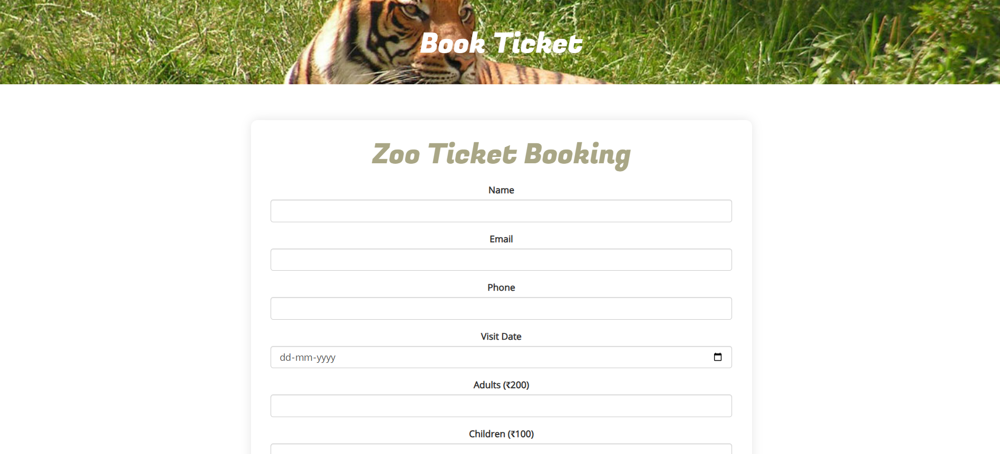
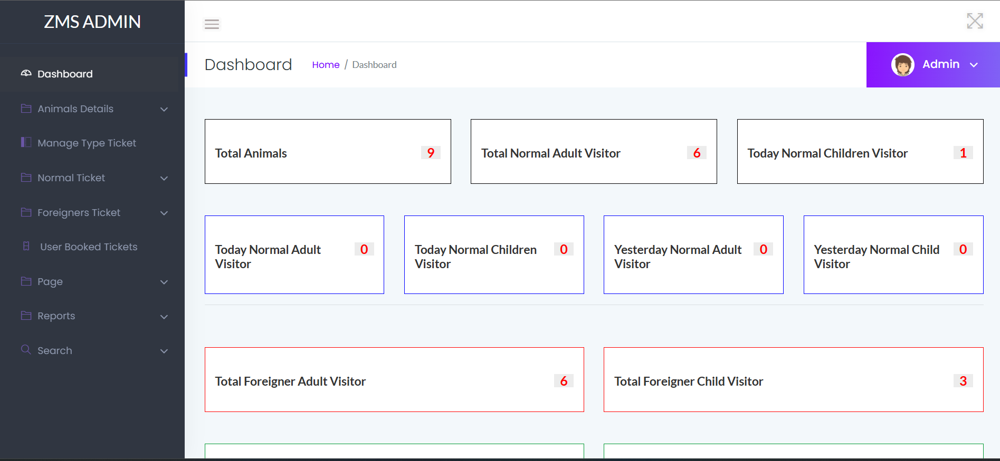

# 🦁 Zoo Management System


A database-driven web application developed using **PHP**, **MySQL**, **HTML5**, **CSS3**, and **JavaScript** to efficiently manage zoo records. The project demonstrates CRUD operations, database integration, responsive web design, and full-stack web development concepts.

---

# 📖 Overview

The Zoo Management System is designed to simplify zoo record management by allowing administrators to add, update, delete, and manage animal information through a secure web interface. It demonstrates practical implementation of PHP, MySQL, CRUD operations, and responsive web development.

---

# ✨ Features

- 🦁 Add, Edit, Delete and View Animal Records
- 👨‍💼 Secure Admin Login
- 👤 Separate Admin and User Interfaces
- 🗃️ MySQL Database Integration
- 🔄 Complete CRUD Operations
- 📱 Responsive User Interface
- 🔍 Easy Navigation
- ⚡ Fast Database Queries

---

# 🛠️ Technologies Used

- PHP
- MySQL
- HTML5
- CSS3
- JavaScript
- XAMPP

---

# 📂 Project Structure

```text
Zoo-Management-System/
│
├── admin/
├── css/
├── fonts/
├── images/
├── includes/
├── js/
├── about.php
├── animals.php
├── animal-detail.php
├── contact.php
├── index.php
├── zmsdb.sql
└── README.md
```

---

## 📸 Screenshots

### 🏠 Home Page


### 🦁 Animals Page


### 📄 Animal Details


### 🎟️ Book Ticket


### 🛠️ Admin Dashboard

# ⚙️ Installation

### 1️⃣ Clone the repository

```bash
git clone https://github.com/varungargvg20-a1y/zoo-management-system.git
```

### 2️⃣ Move the project folder

Copy the project folder into:

```
xampp/htdocs/
```

### 3️⃣ Import the Database

- Open **phpMyAdmin**
- Create a new database
- Import **zmsdb.sql**

### 4️⃣ Start XAMPP

Start:

- Apache
- MySQL

### 5️⃣ Open the Project

```
http://localhost/zoo-management-system/
```

---

# 🔑 Demo Login Credentials

### Admin Login

| Username | Password |
|----------|----------|
| **admin** | **Test@123** |

> **Note:** These credentials are provided only for demonstration purposes.

---

# 🎯 Learning Outcomes

This project helped me gain practical experience in:

- PHP Web Development
- MySQL Database Management
- CRUD Operations
- Responsive Web Design
- Database Design
- Frontend & Backend Integration
- Project Structure and File Organization

---

# 🚀 Future Improvements

- Search & Filter Functionality
- Animal Image Upload
- Dashboard Analytics
- Role-Based Authentication
- Enhanced Security
- Password Hashing
- Better UI/UX

---

# 👨‍💻 Author

**Varun Garg**

**Software Developer | BCA Graduate**

---

# 📄 License

This project is developed for educational and learning purposes only.

---

⭐ If you found this project useful, consider giving it a **Star**.